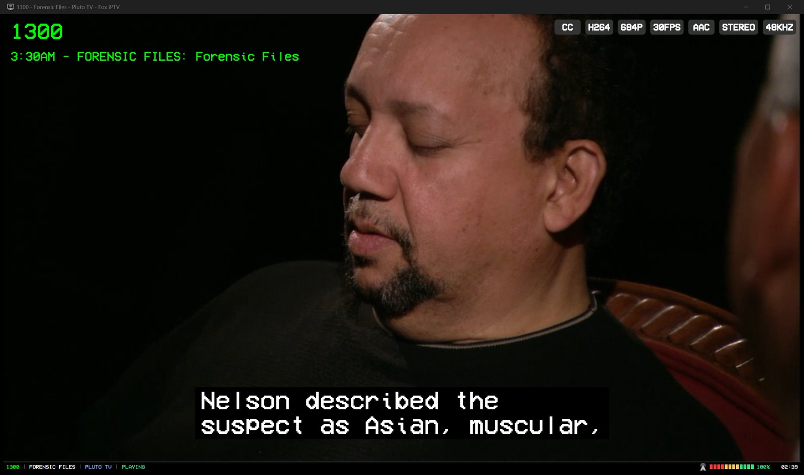
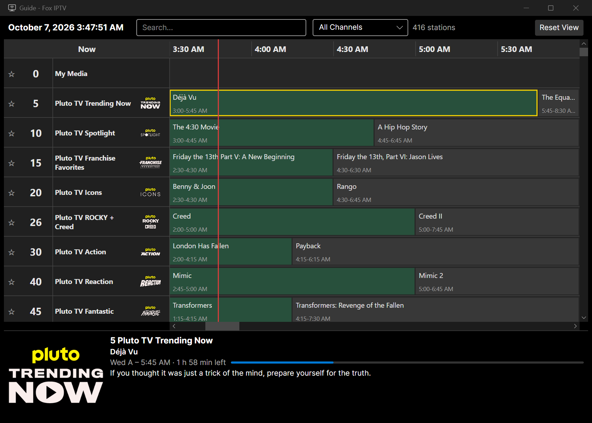
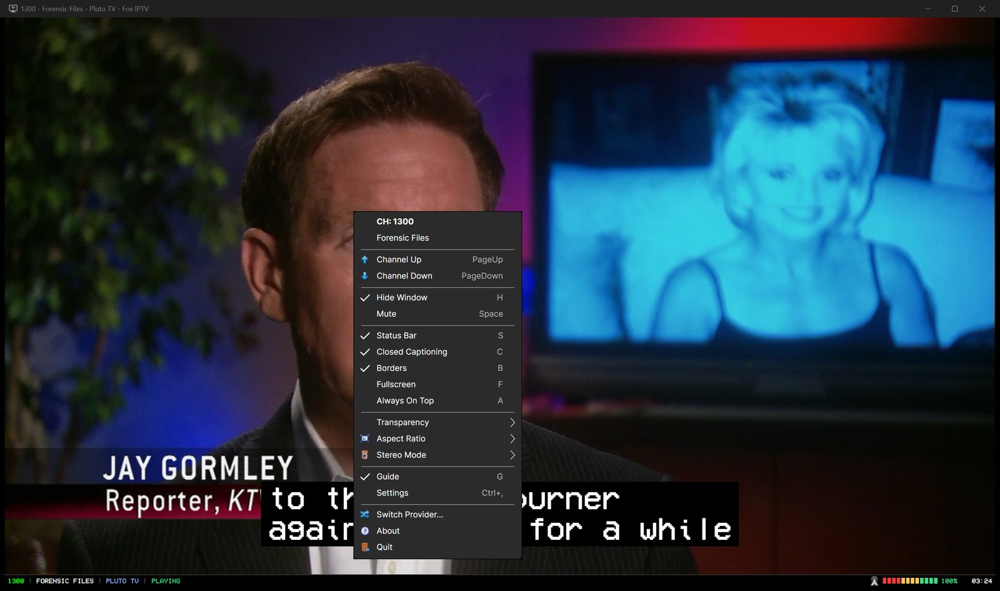
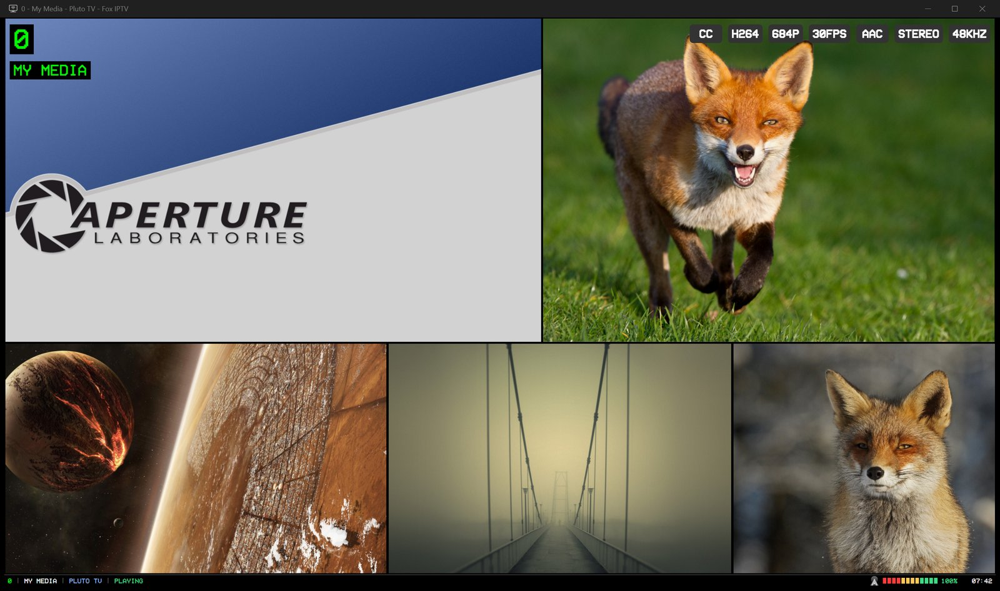
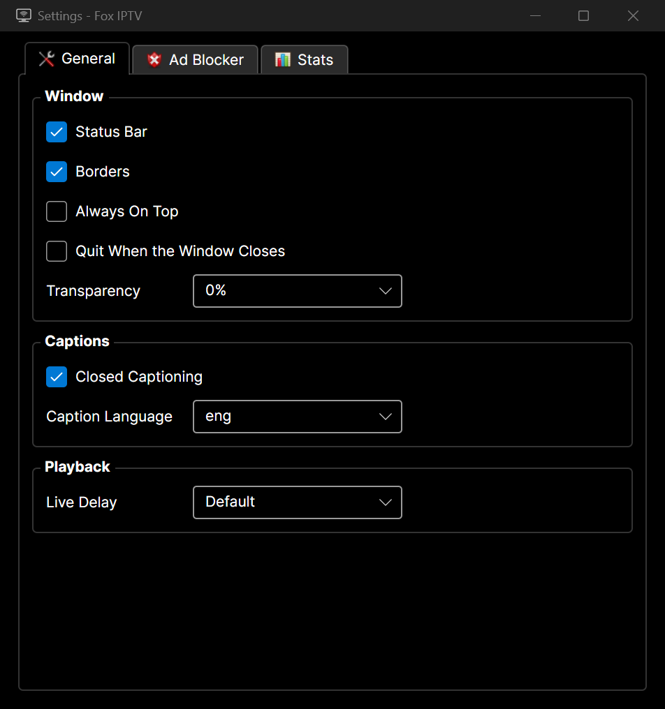
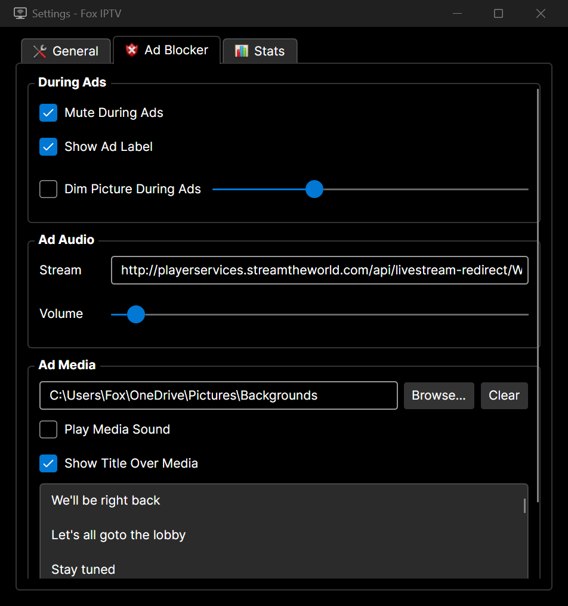

# ═════•°• FoxIPTV •°•═════
The OSS FFmpeg based IPTV client, for Windows, macOS and Linux.

# ═════•°• Screenshots

| Guide | Menu |
|---|---|
|  |  |

| Ad Break | My Media |
|---|---|
|  |  |

| Settings: General | Settings: Ad Blocker |
|---|---|
|  |  |

# ═════•°• Providers
| Provider | Gives you | Needs |
|---|---|---|
| Pluto TV | Live channels with guide data | A region |
| Samsung TV Plus | Live channels | A region |
| Plex | Live channels with guide data | A region |
| Roku | Live channels with guide data | A region |
| IPTV.org | ~15,000 public live channels | Nothing |
| Free-TV | Live channels with guide data | A region |
| M3U Playlist | Any M3U/M3U8 URL, guide auto-detected from the playlist header or given by hand | The URL |

# ═════•°• Building
Needs the .NET 10 SDK. `dotnet build src/FoxIPTV/FoxIPTV.csproj` builds the app, `dotnet test tests/FoxIPTV.Tests` runs the tests.

# ═════•°• Roadmap
- IR Remote Support
- Chromecast'ing
- Hot Key Configuration
- Channel Favorites Only Navigation

# How To Help •°•═════
- Patreon; https://www.patreon.com/FoxCouncil
- Submit a Pull Request
